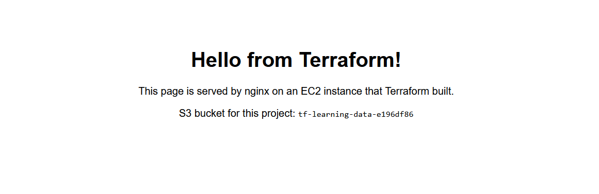
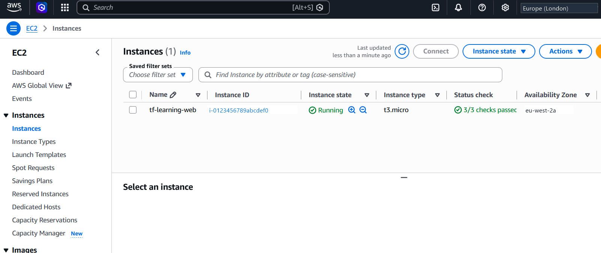

# Terraform + AWS Learning Project

A small, complete, real AWS environment you build with one command: a VPC, a
web server running nginx, a private S3 bucket, and the IAM permissions
connecting them.

**Licence:** [MIT](LICENSE.md) — free to use, modify, and distribute, including
commercially. Provided as-is, without warranty.

> ### ⚠️ This creates real, billable AWS resources
>
> Running `terraform apply` creates an actual EC2 instance, VPC, and S3
> bucket in **your own AWS account**. AWS bills **you** for whatever you
> leave running — this project and its author have no visibility into, or
> control over, your account or your bill. Typical Free Tier accounts pay
> £0 if destroyed promptly, but:
>
> - **You are solely responsible for monitoring your AWS costs and
>   destroying resources you don't need** (see [Destroy when you're
>   done](#important-destroy-when-youre-done)).
> - Free Tier eligibility, limits, and pricing vary by account, region, and
>   time, and are entirely outside this project's control.
> - Leaving resources running, misconfiguring `instance_type`, or exceeding
>   Free Tier limits can and will incur real charges from AWS.
>
> This software is provided **as-is, with no warranty**, under the [MIT
> licence](LICENSE.md) — the author accepts no liability for any AWS
> charges, data loss, or other costs you incur using it. Set up a billing
> alert (see below) before you run `terraform apply`.

## What is Terraform / Infrastructure as Code?

Infrastructure as Code (IaC) means describing your cloud resources — servers,
networks, storage — in text files instead of clicking around a web console.
Terraform reads those files, compares them to what actually exists in AWS, and
creates/updates/deletes resources to match. The huge win: your infrastructure
becomes repeatable, reviewable (it's just code), and disposable — you can
destroy everything and rebuild it identically in minutes.

## What this project builds

| Resource | Purpose |
|---|---|
| VPC (10.0.0.0/16) | Your own isolated network in AWS |
| Public subnet (10.0.1.0/24) | Where the server lives |
| Internet Gateway + route table | Connects the subnet to the internet |
| Security group | Firewall: HTTP (80) from anywhere, SSH (22) from your IP only |
| EC2 instance (micro, free-tier eligible) | Amazon Linux 2023 server running nginx with a hello page |
| IAM role + instance profile | Lets the server access ONE S3 bucket, no keys stored anywhere |
| Private S3 bucket | Storage the server can read/write (random name suffix) |

Estimated cost: **£0 if your account is within the AWS Free Tier** (a free-tier
eligible instance type, low S3 usage) and you destroy it when done. See the
cost section below — please read it.

> **Note:** free-tier eligible instance types vary by account and region and
> change over time. Don't assume `t2.micro` — many accounts today are only
> eligible for `t3.micro` or `t4g.micro`. Check what yours qualifies for:
> `aws ec2 describe-instance-types --filters Name=free-tier-eligible,Values=true --query "InstanceTypes[].InstanceType" --output table`

## Prerequisites

1. **An AWS account** — <https://aws.amazon.com/free>
2. **An IAM user with credentials** — don't use your root account for daily
   work. In the AWS console: IAM → Users → Create user → attach the
   `AdministratorAccess` policy (fine for a personal learning account) →
   create an **access key** (choose "Command Line Interface").
3. **AWS CLI** — install and configure it (PowerShell):

   ```powershell
   winget install Amazon.AWSCLI
   # restart your terminal, then:
   aws configure
   # paste your Access Key ID, Secret Access Key, region: us-east-1, output: json
   aws sts get-caller-identity   # sanity check - shows your account/user
   ```

4. **Terraform** (PowerShell):

   ```powershell
   winget install Hashicorp.Terraform
   # or with Chocolatey:  choco install terraform
   # restart your terminal, then:
   terraform version
   ```

## First run, step by step

All commands run in PowerShell **from this folder**:

```powershell
cd Project-IaC
```

**1. Create your personal variables file**

```powershell
Copy-Item terraform.tfvars.example terraform.tfvars
notepad terraform.tfvars
```

Set `ssh_allowed_cidr` to your public IP + `/32`
(find it at <https://checkip.amazonaws.com>), e.g. `"198.51.100.7/32"`.

**2. Initialize** — downloads the AWS and random providers into `.terraform/`.
Run once per project (and again if you change provider versions):

```powershell
terraform init
```

**3. Format and validate** — good habits from day one:

```powershell
terraform fmt        # auto-formats .tf files to canonical style
terraform validate   # catches syntax/reference errors before touching AWS
```

**4. Plan** — the dry run. Terraform shows exactly what it *would* create
(look for `Plan: 13 to add, 0 to change, 0 to destroy` at the end). Nothing
is created yet. **Always read the plan** — this habit will save you at work:

```powershell
terraform plan
```

**5. Apply** — actually builds it. Terraform shows the plan again and asks
for confirmation; type `yes`:

```powershell
terraform apply
```

After 2–3 minutes you'll see the **outputs**: the instance IP, the website
URL, the bucket name, and an SSH command.

## Verify it worked

1. **Open the website**: copy the `website_url` output (e.g. `http://3.85.x.x`)
   into your browser. You should see "Hello from Terraform!". Give it a
   minute or two after apply — the boot script needs time to install nginx.
   Note it's `http://`, not `https://` (browsers sometimes force https and
   show an error — check the address bar).

   

2. **Check the AWS console**: EC2 → Instances (region: us-east-1) — you'll
   see `tf-learning-web` running. Also peek at VPC → Your VPCs and S3 →
   Buckets. Everything is tagged `Project = terraform-learning`.

   

3. **Re-print outputs anytime**: `terraform output`

## Troubleshooting & lessons learned

Issues hit (and fixed) while building this project — kept here as a reference
in case you run into the same ones.

| Symptom | Cause | Fix |
|---|---|---|
| `InvalidParameterCombination: ... not eligible for Free Tier` on apply | Free-tier eligible instance types differ by account/region and change over time | `aws ec2 describe-instance-types --filters Name=free-tier-eligible,Values=true --query "InstanceTypes[].InstanceType" --output table`, then set `instance_type` in `terraform.tfvars` to one that's actually listed |
| `terraform plan -out` errors with "flag needs an argument" or "is a directory" | `-out` requires a filename, not a bare flag or a directory path | `terraform plan -out=tfplan`, then `terraform apply tfplan` to apply exactly what was reviewed |
| PowerShell says "term not recognized" for a resource name, tag value, or config line copied from a guide | That text describes what to put *inside a config file* — it isn't a shell command | Open the file in a text editor (`notepad terraform.tfvars`) and make the edit there |
| Saved SSH key file (`.pem`) is 0 bytes; AWS says the key pair already exists | `Out-File` truncates on every run, including failed ones — re-running `create-key-pair` after a duplicate-name error wipes the previously saved private key | Run the create command exactly once. To redo it, explicitly `delete-key-pair` and remove the old `.pem` first, then create fresh |
| SSH times out on an IP that worked a minute ago | Changing `key_pair_name` (or other attributes) forces Terraform to destroy + recreate the instance, which gets a new public IP; old browser tabs can also show cached content from a server that no longer exists | Re-check `terraform output` for the current IP after any apply that replaces the instance; hard-refresh stale browser tabs |
| Commands fail inside the SSH session on the instance — `terraform: command not found`, or plain `cp` fails against an `s3://` path | SSH drops you into a separate Linux environment with none of your local machine's tools — Terraform isn't installed there and doesn't need to be | Run Terraform commands on your own PC, not inside the SSH session (`exit` first); use `aws s3 cp` instead of `cp` for S3 paths |
| A command with `<angle-bracket-placeholder>` fails literally | Angle brackets mark a placeholder to substitute, not literal text | Replace with the real value from `terraform output` or the deployed page before running |

## Optional: SSH access + testing S3 from the instance

The instance's IAM role lets it use S3 with **no stored credentials** — the
best way to see that in action is from inside the instance.

**Create a key pair first** (PowerShell — this saves the private key locally):

```powershell
aws ec2 create-key-pair --key-name tf-learning-key --query 'KeyMaterial' --output text | Out-File -Encoding ascii tf-learning-key.pem
```

Then in `terraform.tfvars`, uncomment and set:

```hcl
key_pair_name = "tf-learning-key"
```

Run `terraform apply` again. **Note**: changing the key pair on an existing
instance forces Terraform to **replace** it (destroy + recreate, new IP) —
the plan will tell you so. That's normal; read the plan and confirm.

**SSH in** (Windows 10/11 includes OpenSSH):

```powershell
ssh -i tf-learning-key.pem ec2-user@<instance_public_ip>
```

**Test S3 access from the instance** (you're now in a Linux shell):

```bash
# The bucket name is on the hello page, or run `terraform output bucket_name` on your PC
echo "hello from the instance role" > test.txt
aws s3 cp test.txt s3://<your-bucket-name>/test.txt   # works: role allows PutObject
aws s3 cp s3://<your-bucket-name>/test.txt back.txt   # works: role allows GetObject
aws s3 ls s3://<your-bucket-name>/                    # works: role allows ListBucket
aws s3 ls                                             # FAILS: listing ALL buckets is not granted
```

That last failure is the point: **least privilege**. The role can touch this
one bucket and nothing else. No access keys exist on the instance — run
`aws sts get-caller-identity` there and you'll see it's using the role.

## IMPORTANT: destroy when you're done

```powershell
terraform destroy   # shows what will be deleted, asks for "yes"
```

Build the habit now: **every session ends with destroy** unless you have a
reason to keep things running. Why it matters:

- Free Tier covers 750 hours/month of an eligible micro instance type for
  the first 12 months — but only on eligible accounts, and it expires. A
  forgotten instance after that is roughly **£6–7/month (approx.)**; larger leftovers
  cost real money.
- **Strongly recommended**: set up an AWS Budget alert (console: Billing →
  Budgets → Create budget → Zero spend budget or £4/month (approx.) with email alert).
  Five minutes of setup, permanent peace of mind.
- Rebuilding is one `terraform apply` away — that's the whole point of IaC.
  Destroying costs you nothing but a coffee break.
- **This is your AWS bill, your responsibility.** Neither Terraform nor this
  project's author can see or stop charges accruing on your account — only
  you (via `terraform destroy` and/or a billing alert) can.

If you created the key pair, it lives outside Terraform, so delete it
separately when you're fully done:

```powershell
aws ec2 delete-key-pair --key-name tf-learning-key
Remove-Item tf-learning-key.pem
```

## What each file does

| File | Contents |
|---|---|
| `versions.tf` | Required Terraform and provider versions (pinned for reproducibility) |
| `providers.tf` | AWS provider config: region + default tags on everything |
| `variables.tf` | Input variables with descriptions, defaults, and validation |
| `network.tf` | VPC, subnet, internet gateway, route table, security group |
| `compute.tf` | AMI lookup (data source) + the EC2 instance |
| `user_data.sh.tpl` | Boot script template: installs nginx, writes the hello page |
| `iam.tf` | IAM role, least-privilege S3 policy, instance profile |
| `storage.tf` | Private S3 bucket with random name suffix + public access block |
| `outputs.tf` | Values printed after apply (IP, URL, bucket, SSH command) |
| `terraform.tfvars.example` | Template for your personal values — copy to `terraform.tfvars` |
| `.gitignore` | Keeps state files, `.terraform/`, tfvars, and keys out of git |

Files Terraform creates for itself: `terraform.tfstate` (the **state file** —
Terraform's record of what it built; treat it as sensitive and never edit it
by hand), `.terraform/` (downloaded providers), and `.terraform.lock.hcl`
(exact provider versions — this one *should* be committed to git).

## What to learn next

- **Remote state**: store `terraform.tfstate` in an S3 bucket with locking
  instead of on your laptop — required for teams, and "v2" of this project.
- **Modules**: package this VPC+EC2 pattern into a reusable module and call
  it with different inputs. Browse the public Terraform Registry for
  community modules (e.g. `terraform-aws-modules/vpc/aws`).
- **Workspaces / environments**: run dev and prod copies of the same code
  (workspaces, directory-per-environment, or Terragrunt).
- **SSM Session Manager**: shell access to instances with **no SSH port, no
  key pairs** — attach the `AmazonSSMManagedInstanceCore` policy to the role
  and you can delete the port-22 rule entirely. The modern production way.
- **Linters/scanners**: `tflint`, `checkov`, `tfsec` — catch mistakes and
  security issues automatically.
- Command habits: `terraform fmt -recursive`, `terraform plan -out=tfplan`,
  `terraform apply tfplan` (apply exactly what you reviewed).
